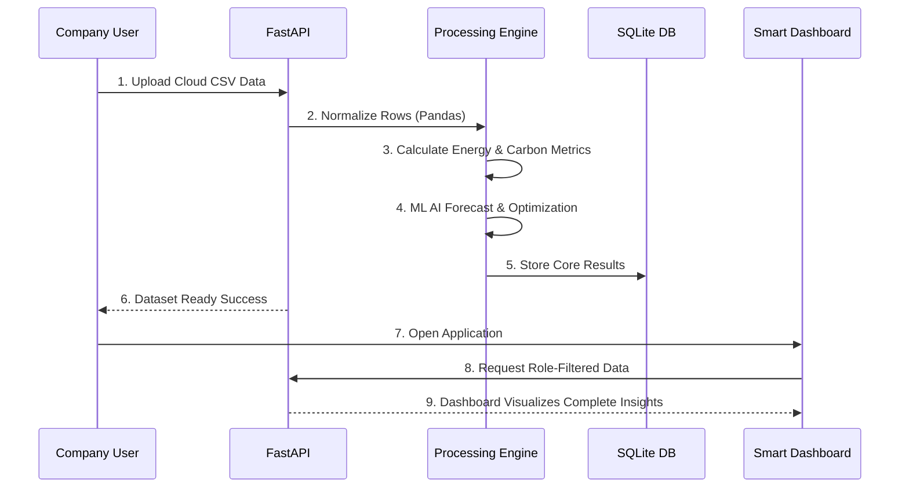
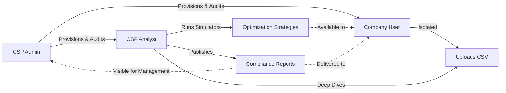

# CarbonLens AI - Presentation Document

This document provides structured content for a slide deck or presentation about CarbonLens AI. It now includes Markdown Mermaid diagrams which you can directly translate into shapes on your slides.

---

## Slide 1: Title Slide
**Title:** CarbonLens AI
**Subtitle:** Cloud Carbon Footprint Intelligence Platform
**Description:** Estimating, analyzing, predicting, and optimizing cloud emissions for a sustainable future.

---

## Slide 2: What is CarbonLens AI?
**Heading: Platform Overview**
- **Definition:** A cutting-edge, multi-tenant cloud operations platform.
- **Core Purpose:** To transform raw cloud usage data into actionable sustainability metrics.
- **Key Capabilities:**
  - Standardizes cloud usage data to calculate environmental impact.
  - Generates emission estimates and energy usage patterns.
  - Predicts future carbon impact utilizing AI/ML.
  - Simulates scenarios ("what-if") for optimization.
  - Generates comprehensible green audits and compliance reports.

---

## Slide 3: Why is it Used?
**Heading: The Problem & Our Solution**
- **The Problem:** 
  - Organizations use immense cloud resources (CPU, Network, Storage) without visibility into carbon emissions.
  - Tracking multi-tenant emissions natively is time-consuming and prone to errors.
- **The Solution:**
  - **Visibility:** Centralized dashboard for Carbon, Energy, Cost, and Sustainability.
  - **Optimization:** Green Audit & computing recommendations.
  - **Forecasting:** AI to predict anomalies and future limits.

---

## Slide 4: High-Level Architecture & Tech Stack
**Heading: Robust, Fast, and Scalable Architecture**

> *(Use the diagram below to recreate a block-diagram connecting your Frontend, API, and Database)*

```mermaid
graph TD
    Client[Browser Accounts] -->|HTTPS & JWT| Frontend
    subgraph "Frontend Engine"
        Frontend(React 18 + Vite)
        UI(Custom CSS | Recharts | Framer M.)
        Frontend --- UI
    end
    
    Frontend <-->|Axios API Requests| Backend
    
    subgraph "Backend Engine"
        Backend(FastAPI + Uvicorn)
        Sec(Role-based Auth)
        Logic(Carbon Metrics + AI Models)
        Backend --- Sec
        Backend --- Logic
    end
    
    Backend <-->|SQLAlchemy ORM| DB[(SQLite Database)]
    Logic <-->|Pandas + Scikit-learn| ML[ML Predictions & Reports]
```

**Technology Highlights:**
- **Frontend Layer:** React 18, Vite, Recharts, Framer Motion
- **API Engine:** FastAPI, Python, JWT Bearer Auth
- **Data & ML Layer:** SQLite, Pandas, Scikit-learn

---

## Slide 5: Data Processing Workflow & Flowchart
**Heading: The Data Lifecycle — From Upload to Intelligence**

> *(Use the sequence diagram below to show how a user gets metrics from a raw file upload)*



---

## Slide 6: Target Audience & Role Architecture
**Heading: Role-Based Workflow & Security Provisioning**

> *(Use the flowchart below to show the hierarchy of users and data isolation)*



**Roles Summarized:**
1. **CSP Admin:** Platform security, company management, and issuing roles.
2. **CSP Analyst:** The "Data cruncher" running advanced simulations and sending finalized compliance reports.
3. **Company User:** Client uploading local datasets to monitor their isolated dashboards and strategies automatically.

---

## Slide 7: Core Features
**Heading: Key Platform Capabilities**
- **Dynamic Dashboards:** Real-time metrics for Cloud Carbon (CO2e) and Cost Efficiency.
- **AI Forecasting:** Predict future footprints based on historical data.
- **Green Audit & Optimizer:** Identifying idle compute resources.
- **Data Simulator:** Simulating region-switching for instant emission previews.
- **Report Engine:** End-to-end report delivery system.

---

## Slide 8: Recent Project Updates & Technical Achievements
**Heading: What's New & Production Ready**
- **Performance Optimizations:** Sub-second backend dataset processing and UI load stabilization.
- **Security Enhancements:** Automated user provisioning explicitly controlled by Admins to stop self-escalation.
- **Multi-Tenant Protection:** Strict SQL data filtering enforced via `company_id`.
- **Green Audit Expansion:** Identical audit intelligence across both user types.

---

## Slide 9: Future Scope
**Heading: Roadmap & Next Steps**
- **Multi-Account/Org Dashboard:** Extending features for umbrella organizations and projects.
- **Alerts Tracking System:** Intelligent push notifications (e.g., "Idle compute increased 18%").
- **AI Chat Assistant:** Embedding an AI chatbot right into the dashboard for accessible ad-hoc platform queries.
