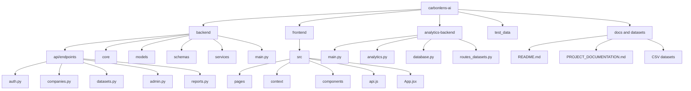
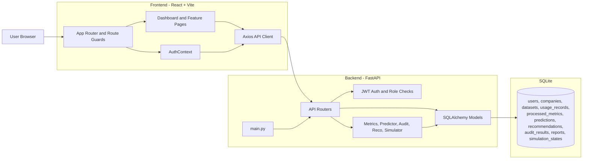
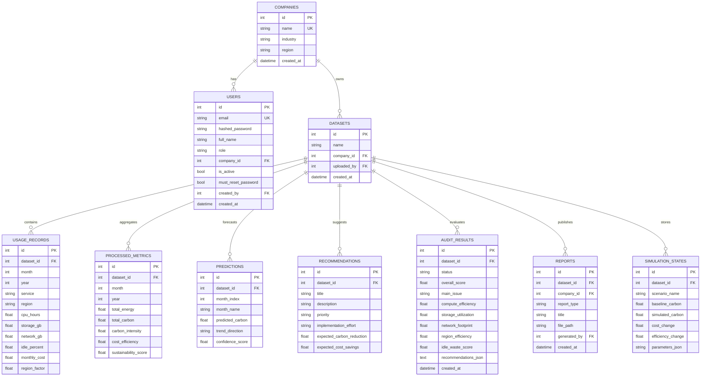
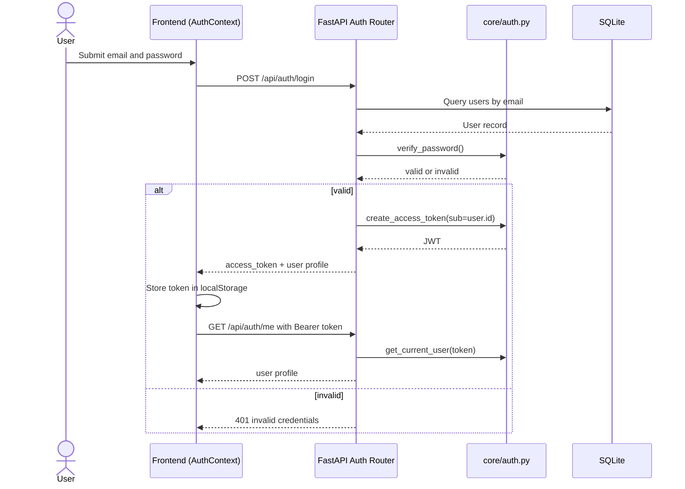
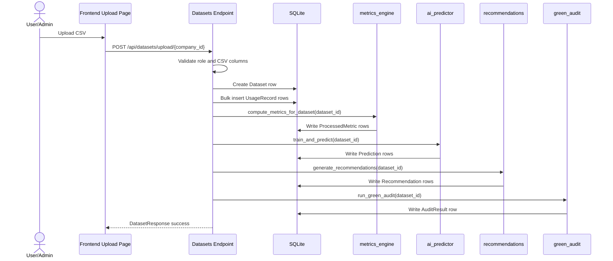
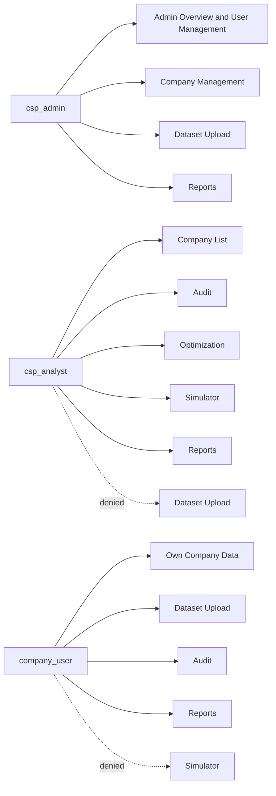
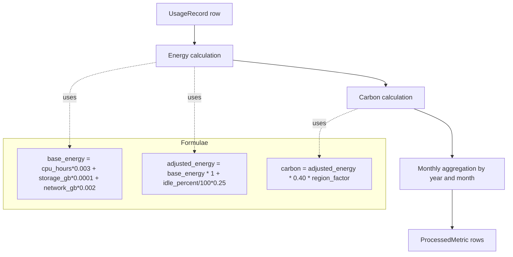
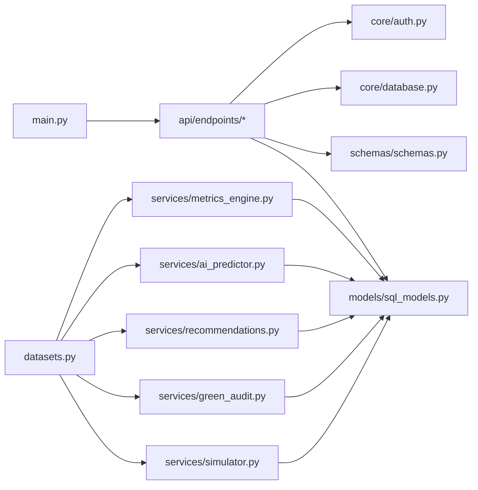
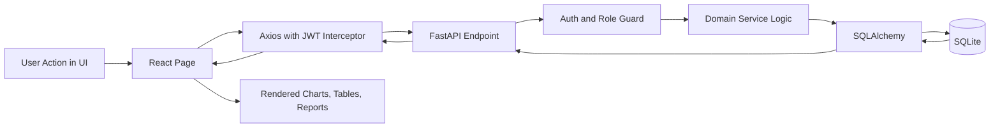

# CarbonLens AI - Visual Diagrams

This file provides end-to-end visual documentation for the project using Mermaid diagrams.

## 1. Project Map



## 2. Architecture Overview



## 3. Backend Internal Architecture

```mermaid
flowchart TB
  entry[main.py]
  entry --> cors[CORS + Slow Request Middleware]
  entry --> seed[Startup Admin Seeding]
  entry --> mount[Router Registration]

  mount --> r_auth[/api/auth]
  mount --> r_comp[/api/companies]
  mount --> r_data[/api/datasets]
  mount --> r_admin[/api/admin]
  mount --> r_reports[/api/reports]

  r_auth --> core_auth[core/auth.py]
  r_comp --> core_auth
  r_data --> core_auth
  r_admin --> core_auth
  r_reports --> core_auth

  r_data --> svc_metrics[services/metrics_engine.py]
  r_data --> svc_ai[services/ai_predictor.py]
  r_data --> svc_rec[services/recommendations.py]
  r_data --> svc_audit[services/green_audit.py]
  r_data --> svc_sim[services/simulator.py]

  core_auth --> models[models/sql_models.py]
  svc_metrics --> models
  svc_ai --> models
  svc_rec --> models
  svc_audit --> models
  svc_sim --> models
```

## 4. Database ER Diagram



## 5. Authentication Workflow



## 6. Dataset Upload and Processing Workflow



## 7. Dashboard Data Retrieval Workflow

```mermaid
flowchart TD
  A[Frontend opens Dashboard] --> B[GET /api/datasets/{id}/dashboard]
  B --> C[Validate dataset access]
  C --> D[Load aggregated summary from ProcessedMetric]
  D --> E[Load prediction rows]
  E --> F{Predictions exist?}
  F -- No --> G[Generate predictions on-demand]
  F -- Yes --> H[Reuse existing predictions]
  G --> I[Compose dashboard payload]
  H --> I
  I --> J[Frontend renders KPI cards, trends, region/service charts]
```

## 8. Role-Based Access Control Map



## 9. Frontend Routing and Guard Flow

```mermaid
flowchart TD
  R[BrowserRouter] --> P{Protected route?}

  P -- No --> L[/login, /signup]
  P -- Yes --> T{Has user token and /me valid?}

  T -- No --> L
  T -- Yes --> M{must_reset_password?}

  M -- Yes --> RP[/reset-password]
  M -- No --> G[App layout: Sidebar + Header + Outlet]

  G --> D{Route and role check}
  D --> D1[/ -> SmartDashboard]
  D --> D2[/companies -> admin or analyst]
  D --> D3[/users -> admin only]
  D --> D4[/upload -> company_user or admin]
  D --> D5[/audit -> analyst or company_user]
  D --> D6[/optimization -> analyst]
  D --> D7[/simulator -> analyst]
  D --> D8[/reports -> any authenticated user]
```

## 10. Carbon and Metrics Computation Logic



## 11. Code Dependency Diagram (Backend)



## 12. End-to-End Request Lifecycle



## 13. Notes

- Diagrams are aligned to the active Python backend in backend, not backend-old.
- The analytics-backend appears as a separate module and can be integrated later via API gateway or internal service calls.
- Mermaid rendering works in VS Code Markdown preview and most Git-hosted Markdown renderers.
